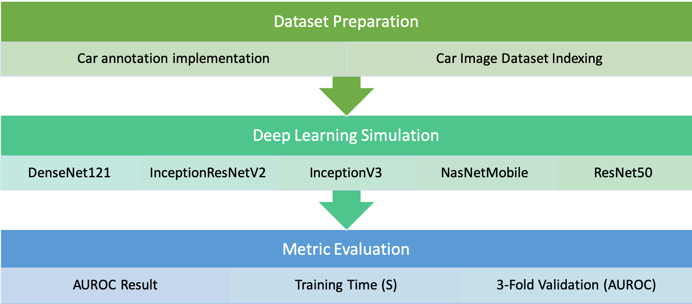
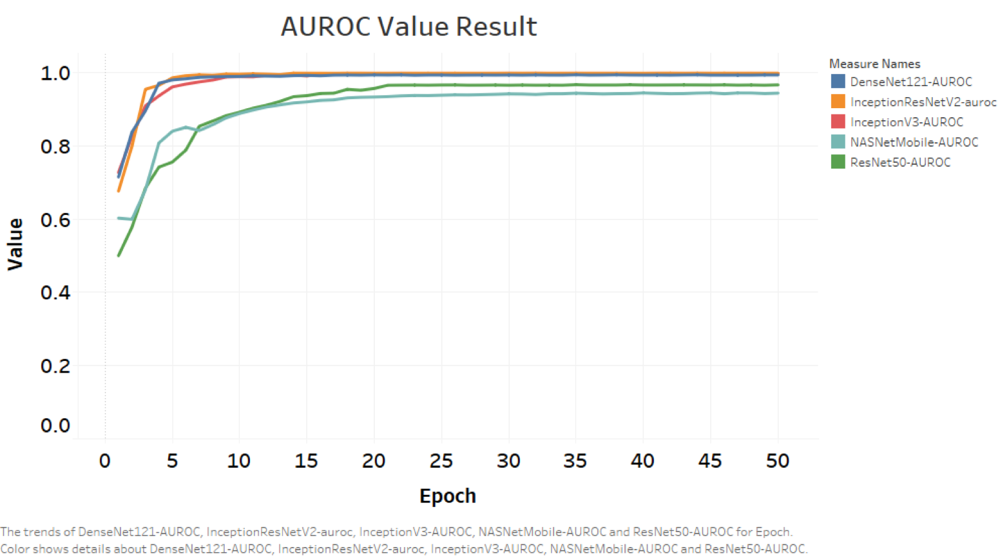
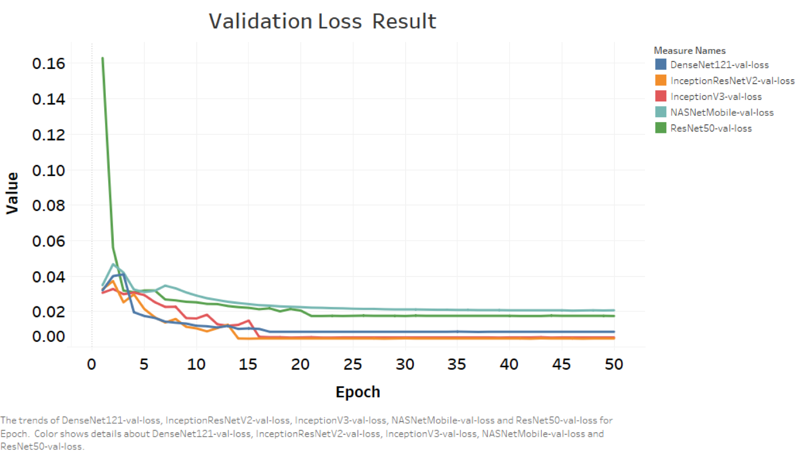
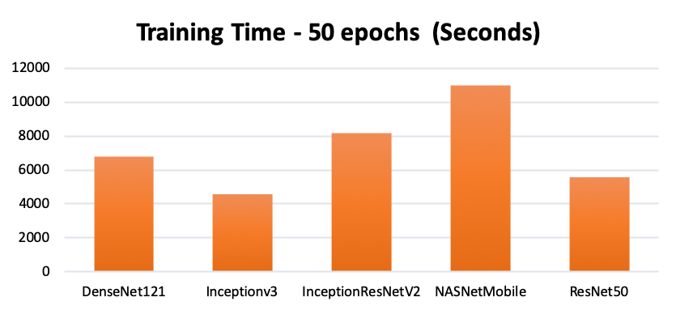

# Contents

## Overviews
## Result
## How to run the code

## Overviews

 

The implementation for detecting car make and model is started by doing data preprocessing to obtain car label for training and testing. The next step is to train the deep learning model for car make and model detection. After training the model, car make and model detection is performed from testing dataset.

The method for detect car make and model is implemented by using Inception-V3 network by Google. The training and testing code is borrowed from [Chexnet-Keras implementation](https://github.com/brucechou1983/CheXNet-Keras) with a modification.  Data preprocessing is implemented using Python. Keras is also used to implement the model for the deep learning method. For evaluation, Sklearn is used to compute accuracy, precision and recall.

## Result

## How to run the code
### Training & Testing
*   Please follow this guide for deep learning framework initialization - [https://github.com/brucechou1983/CheXNet-Keras](https://github.com/brucechou1983/CheXNet-Keras) 

### Training
*   Download the pre-processed dataset file (Anotated images of car) - [all-car-data.zip](https://drive.google.com/file/d/1nEsxR8dGAqcrEb7TCYufpTI7amNjza1N/view?usp=sharing)
*   Replace files train.py and config.ini from https://github.com/brucechou1983/CheXNet-Keras repository, with these files   [train.py](https://github.com/satriabw/AIforSEAComputerVision/blob/master/test.py) - modified train.py and [config.ini](https://github.com/satriabw/AIforSEAComputerVision/blob/master/config/train/config.ini) - modified config.ini
*   Put car_split, car_split_2, and car_split_3 folders in file index in /data folder together with default_split folder
*   Run python train.py to train to train the model

### Testing
*   Download testing data from [testing_data.zip](https://www.dropbox.com/sh/jyhtjeam3xy55ts/AABayG6hGNjSoGw-HZs954ipa?dl=0), move test.csv to /experiments/car-split-InceptionV3 folder
*   Replace files test.py and config.ini from https://github.com/brucechou1983/CheXNet-Keras repository, with these files [test.py](https://github.com/satriabw/AIforSEAComputerVision/blob/master/test.py) - modified train.py and [config.ini](https://github.com/satriabw/AIforSEAComputerVision/blob/master/config/test/config.ini) - modified config.ini
*   Run test.py to test the model
*   Open /experiments/car-split-InceptionV3/test.log to see confidence score for each prediction, accuracy, precision and recall.

